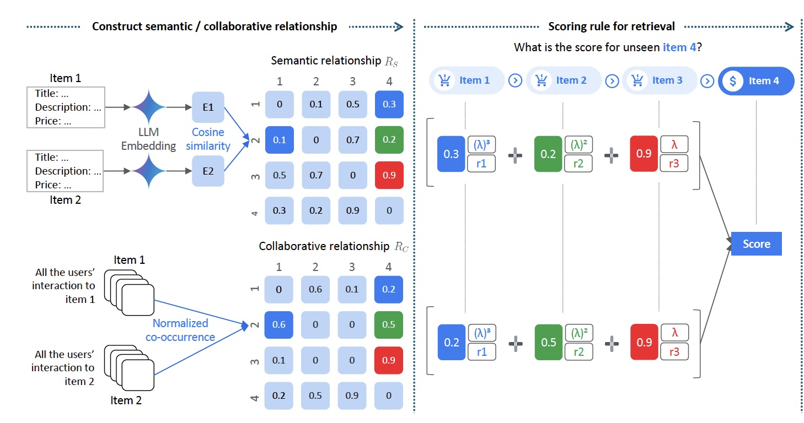

# **Enhanced STAR Recommendation System with GPT-2 Sorting**

This project extends the **STAR** recommendation system by incorporating **GPT-2** into the sorting phase. The original retrieval pipeline from the STAR paper is enhanced by generating rankings using not only semantic and collaborative filtering but also GPT-2's natural language understanding. This improvement allows for better personalization of recommendations based on user interaction history.

## **Project Overview**

This repository builds upon the **STAR** retrieval pipeline and introduces an enhanced sorting mechanism using GPT-2. The recommendation system now uses a combination of semantic similarity, collaborative filtering, and GPT-2 generated scores to rank candidate items. The modifications are made to `star_retrieval.py` for scoring candidates with GPT-2 and to `main.py` for managing the pipeline flow and evaluation. This framework effectively replicates the **STAR** framework from the paper, with the only modification being the use of GPT-2 in the sorting phase to improve ranking.

## **Key Contributions**

1. **Retrieval Stage**: Based on the **STAR** framework, this stage combines semantic embeddings and collaborative filtering for the initial ranking of candidate items.
2. **Ranking Stage**: GPT-2 is used to refine the ranking of candidate items, leveraging its natural language understanding capabilities to adjust the priority of items.
3. This framework effectively enhances recommendation quality by reproducing the core ideas of the **STAR** paper, with the addition of GPT-2 providing a new intelligent layer in the sorting phase.

---

### How to Use GPT-2 in the Project:

#### 1. **Download GPT-2 Model Files**:

To use GPT-2 for ranking optimization, download the necessary files from the [Hugging Face GPT-2 Model Page](https://huggingface.co/openai-community/gpt2/tree/main). The required files are:

* `config.json`
* `merges.txt`
* `pytorch_model.bin`
* `vocab.json`

Save these files in a folder (e.g., `D:/surf-RAG/GPT-2/`).

#### 2. **Modify `star_retrieval.py`**:

In `star_retrieval.py`, update the GPT-2 model path:

```python
gpt2_model_path = "D:/surf-RAG/GPT-2"  # Set the GPT-2 model path here
retrieval = STARRetrieval(
    semantic_weight=0.5,
    temporal_decay=0.7,
    history_length=3,
    gpt2_model_path=gpt2_model_path  # Pass GPT-2 model path
)
```

Ensure the path points to the directory containing the four files you downloaded.

#### 3. **Modify `main.py`**:

In `main.py`, make sure the GPT-2 model path is set as follows:

```python
gpt2_model_path = "D:/surf-RAG/GPT-2"  # Set the GPT-2 model path here
retrieval = STARRetrieval(
    semantic_weight=0.5,
    temporal_decay=0.7,
    history_length=3,
    gpt2_model_path=gpt2_model_path  # Pass GPT-2 model path
)
```

Now, when you run the project, GPT-2 will be used to provide additional scoring based on the user's history, optimizing the final ranking.

---

## Running the Project

### Hints:

0. Install conda on your PC/Lab PC, and use conda to create a python 3.11 environment.

   ```bash
   conda create -n envname python=3.11
   ```

1. **Install** Python dependencies via Poetry:

   ```bash
   poetry install
   ```

2. **Run** the main pipeline:

   ```bash
   poetry run python src/main.py
   ```

### Potential Results:

```
Final Results:

Results for Beauty dataset:
------------------------------
Metric          Score     
------------------------------
hit@10          0.0632
hit@5           0.0611
ndcg@10         0.0477
ndcg@5          0.0470
------------------------------
```


Appendix:
# STAR: A Simple Training-free Approach for Recommendations using Large Language Models

This repository implements the retrieval pipeline from the paper [STAR: A Simple Training-free Approach for Recommendations using Large Language Models](https://arxiv.org/abs/2410.16458). It aims to help understand how a training-free recommendation system can be built using:

1. LLM embeddings for semantic similarity
2. User interaction patterns for collaborative signals
3. Temporal decay for recent history weighting



---

## Key Components & Implementation Details

### 1. Item Embeddings (`item_embeddings_vertex_ai.py`)

The embeddings are the foundation of semantic similarity:

```python
class ItemEmbeddingGenerator:
    def create_embedding_input(self, item_data: Dict) -> TextEmbeddingInput:
        # Creates rich text prompts including:
        # - Full item description
        # - Title
        # - Category hierarchy
        # - Brand (if not ASIN-like)
        # - Price and sales rank
```

Key implementation details:

* Uses Vertex AI's `text-embedding-005` model (768 dimensions). [I rewrote ItemEmbeddingGenerator by using the BGE Model]
* Excludes IDs/URLs to avoid trivial matching
* Preserves complete metadata structure

---

### 2. STAR Retrieval (`star_retrieval.py`)

The core scoring logic combines three components:

1. **Semantic Matrix** (R_s):

```python
# Compute cosine similarities between normalized embeddings
semantic_matrix = 1 - cdist(embeddings_array, embeddings_array, metric='cosine')
np.fill_diagonal(semantic_matrix, 0)  # Zero out self-similarities
```

2. **Collaborative Matrix** (R_c) (`collaborative_relationships.py`):

```python
# Normalize by user activity sqrt
user_activity = np.sum(interaction_matrix, axis=0)
normalized = interaction_matrix / np.sqrt(user_activity)
collaborative_matrix = normalized @ normalized.T
```

3. **Scoring Formula**:

```python
score = 0.0
for t, (hist_item, rating) in enumerate(zip(reversed(user_history), reversed(ratings))):
    sem_sim = semantic_matrix[cand_idx, hist_idx]
    collab_sim = collaborative_matrix[cand_idx, hist_idx]
    combined_sim = (semantic_weight * sem_sim + (1 - semantic_weight) * collab_sim)
    score += (1/n) * rating * (temporal_decay ** t) * combined_sim
```

### 3. GPT-2 Scoring

I have integrated **GPT-2** for additional scoring of candidate items based on the user's history:

* **GPT-2 Integration**: I create a prompt based on the user's history and ask GPT-2 to provide a score for the candidate item.

```python
prompt = f"Given the items the user has liked: {history_str}. How would you rate this item: {candidate_item}?"
gpt2_score = self.get_gpt2_score(prompt)
```

* This score is added with a small weight to the final recommendation score.

### 4. Critical Implementation Details

#### Chronological Ordering

The code strictly maintains temporal order (`temporal_utils.py`):

* Sorts reviews by timestamp
* Handles duplicate timestamps
* Ensures test items are truly last in sequence

#### Evaluation Protocol

The evaluation (`evaluation_metrics.py`) matches the paper's setup:

* Leave-last-out evaluation
* Use the full dataset for evaluation
* Metrics: Hits@5/10, NDCG@5/10

---

## Dataset and Download Instructions

1. **Download** the [Stanford SNAP 5-core Amazon datasets](http://snap.stanford.edu/data/amazon/productGraph/categoryFiles/) using `download_data.py`.
   For example:

   ```bash
   poetry run python download_data.py --category beauty
   ```

   This downloads `reviews_Beauty_5.json.gz` and `meta_Beauty.json.gz` into the `data/` folder.

2. **Check data** with `check_data.py`:

   ```bash
   poetry run python check_data.py
   ```

   This prints the first few lines and verifies the JSON parse.

> **Note**: These files named `reviews_Beauty_5.json.gz` etc. are already **5-core** datasets. The code still enforces ≥5 interactions, but typically no users/items are removed since the data is already filtered.

---

## Running the Project

1. **Install** Python dependencies via Poetry:

   ```bash
   poetry install
   ```

2. **Run** the main pipeline:

   ```bash
   poetry run python src/main.py
   ```

   This:

   * Loads reviews and metadata,
   * Sorts each user’s reviews by timestamp (fixing potential out-of-order entries),
   * Creates or loads item embeddings,
   * Computes the semantic and collaborative matrices,
   * Runs GPT-2 scoring on candidates,
   * Splits data into train/val/test in a leave-last-out manner,
   * Runs evaluation with 99 negative samples for each user’s test item,
   * Prints final Hits@K, NDCG@K metrics.

---

## Implementation Tips & Pitfalls

1. **Data Quality Matters**

   * Use `DataQualityChecker` to verify metadata richness
   * Check for duplicate timestamps
   * Verify chronological ordering

2. **Embedding Generation**

   * Include all relevant metadata for rich embeddings
   * Avoid ID/URL information that could leak
   * Use consistent field ordering in prompts

3. **Matrix Computation**

   * Normalize embeddings before similarity
   * Proper user activity normalization for collaborative
   * Zero out diagonal elements

4. **Common Issues**

   * Future item leakage in negative sampling
   * Timestamp ordering issues
   * Inadequate metadata in prompts

---

## Key Parameters

```python
# Retrieval parameters (star_retrieval.py)
semantic_weight = 0.5    # Weight between semantic/collaborative
temporal_decay = 0.7    # Decay factor for older items
history_length = 3      # Number of recent items to use

# Evaluation parameters (evaluation_metrics.py)
k_values = [5, 10]      # Top-k for metrics
```

## Understanding the Output

The code provides detailed statistics:

```
Semantic Matrix Statistics:
- mean_sim: Average semantic similarity
- sparsity: Fraction of zero elements
- min/max_sim: Similarity range

Collaborative Matrix Statistics:
- mean_nonzero: Average co-occurrence strength
- sparsity: Interaction density
```

These help diagnose if the embeddings or collaborative signals are working as expected.

## Results

```
Final Results:

Results for Beauty dataset:
------------------------------
Metric          Score     
------------------------------
hit@10          0.0632
hit@5           0.0611
ndcg@10         0.0477
ndcg@5          0.0470
------------------------------
```

## Example Output

See [beauty_results.md](beauty_results.md) for the results on the Beauty dataset.

---

## Apply to Your Own Data

See [Application Data Specification](application_data_spec.md) for how to prepare your own data.

---

## References

```bibtex
@article{lee2024star,
  title={STAR: A Simple Training-free Approach for Recommendations using Large Language Models},
  author={Lee, Dong-Ho and Kraft, Adam and Jin, Long and Mehta, Nikhil and Xu, Taibai and Hong, Lichan and Chi, Ed H. and Yi, Xinyang},
  journal={arXiv preprint arXiv:2410.16458},
  year={2024}
}
```
